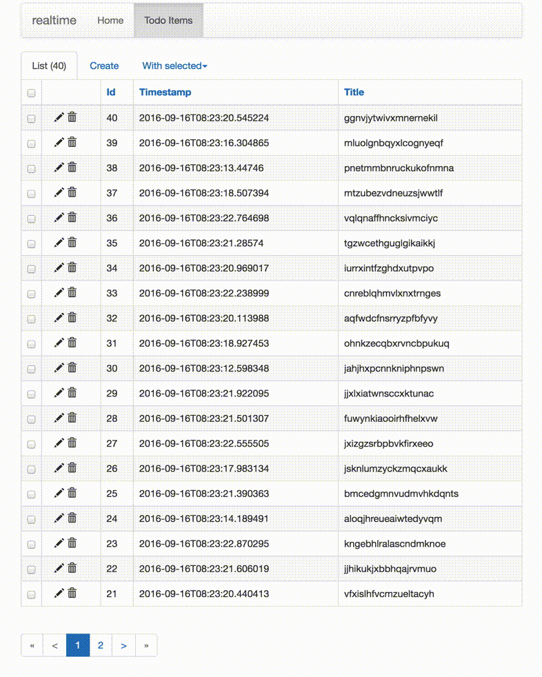

A challenge for building realtime web clients is that the server must know which records the client is currently rendering.

Option 1: web server remembers which unique IDs it rendered for client

*   Original records receive updates and deletes
*   Relatively easy to implement
*   New records that would have fit the original query's parameters don't appear

Option 2: web server remembers the client's query parameters

*   All updates, creates, deletes will appear for client
*   With Flask-Admin the query parameters are a known set of filters and sorts
*   Harder to implement

We're going to start with Option 1.

First, we override the default list template to [add unique IDs to each cell in the HTML table](https://github.com/PierreRochard/realtime-flask-experiment/blob/master/realtime/webserver/templates/admin/model/list.html#L158). This will make life easier when we receive an update and need to modify that specific cell's text. I also added a [realtime block at the top](https://github.com/PierreRochard/realtime-flask-experiment/blob/master/realtime/webserver/templates/admin/model/list.html#L13).

The realtime block contains the JavaScript that [connects](https://github.com/PierreRochard/realtime-flask-experiment/blob/master/realtime/webserver/templates/realtime.html#L7-L12) to the Flask-SocketIO [server](https://github.com/PierreRochard/realtime-flask-experiment/blob/master/realtime/webserver/socket_io.py#L9). When the connection is established the script [sends the table name and a list of record IDs](https://github.com/PierreRochard/realtime-flask-experiment/blob/master/realtime/webserver/templates/realtime.html#L17-L19) that were rendered. This data is generated server-side by a [function](https://github.com/PierreRochard/realtime-flask-experiment/blob/master/realtime/webserver/webapp.py#L17-L24), accessible in the template thanks to Flask's [context processor](http://flask.pocoo.org/docs/0.11/templating/#context-processors) feature.

The table name and list of IDs is received by the Flask-SocketIO server and [inserted into a SQLite table](https://github.com/PierreRochard/realtime-flask-experiment/blob/master/realtime/webserver/socket_io.py#L17-L24).

When an update is made on the todo\_items table the PostgreSQL database [emits a notification](https://github.com/PierreRochard/realtime-flask-experiment/blob/master/realtime/database/create_functions.sql#L26). This notification is [consumed](https://github.com/PierreRochard/realtime-flask-experiment/blob/master/realtime/database/pgpubsub_client.py#L17) by pgpubsub on an eventlet greenthread. The subscriptions SQLite table is [queried](https://github.com/PierreRochard/realtime-flask-experiment/blob/master/realtime/database/pgpubsub_client.py#L36-L42) to see if the updated record's ID is currently rendered in a client. If it is, a socket.io message is [emitted](https://github.com/PierreRochard/realtime-flask-experiment/blob/master/realtime/database/pgpubsub_client.py#L43-L47) to that specific client.

The client [receives](https://github.com/PierreRochard/realtime-flask-experiment/blob/master/realtime/webserver/templates/realtime.html#L37-L43) the update and modifies the relevant "cells" in the HTML table.

There are a few improvements that I'd like to make to this experiment:

1.  Replace SQLite with redis. SQLite is certainly simpler but it is problematic if we're going to put this app on gunicorn with several workers.
    
2.  Factor out the pgpubsub client. Ideally it would be a modern asyncio script that takes Postgres notifications, looks up the socket.io client in redis, and emits the notification to the client.
    
3.  Wrap the notification triggers with SQLAlchemy so that they can be created for any given model with just a decorator.
    
4.  Further customize the template so that the columns do not resize (too often).
    

Longer term, Option 2 of full query subscriptions is still worth exploring as new records can be important to the user.

